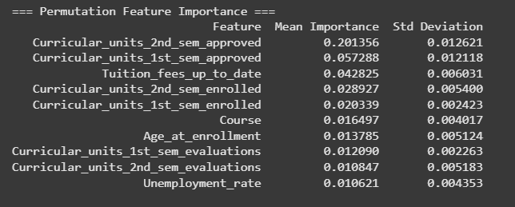

# Submission Akhir: Menyelesaikan Permasalahan Institusi Pendidikan

## Business Understanding
Jaya Jaya Institut merupakan salah satu institusi pendidikan tinggi yang telah berdiri sejak tahun 2000 dan dikenal dengan reputasinya dalam mencetak lulusan berkualitas. Namun, dalam beberapa tahun terakhir, institusi ini menghadapi tantangan serius terkait tingginya tingkat siswa yang tidak menyelesaikan pendidikan atau mengalami dropout. Jumlah dropout yang signifikan ini menjadi perhatian utama karena dapat mencoreng reputasi institusi, menurunkan akreditasi, serta mempengaruhi performa operasional secara keseluruhan.

## Permasalahan Bisnis
- Tingginya tingkat siswa yang mengalami dropout dalam beberapa tahun terakhir.
- Tidak adanya sistem visualisasi yang dapat membantu pihak institusi dalam memahami dan memantau faktor-faktor yang berkontribusi terhadap risiko dropout.
- Kebutuhan institusi untuk mengambil tindakan preventif secara cepat berdasarkan data agar siswa yang berisiko dropout dapat diberi bimbingan dan dukungan yang sesuai.

## Cakupan Proyek
- Melakukan eksplorasi data untuk memahami distribusi siswa serta variabel-variabel yang berkaitan dengan kemungkinan terjadinya dropout.
- Membuat business dashboard yang menampilkan visualisasi performa siswa serta indikator-indikator risiko dropout.
- Menyusun insight dan rekomendasi awal untuk membantu pihak institusi dalam melakukan intervensi tepat waktu guna meningkatkan retensi siswa.
- Membangun prototype awal untuk membantu Jaya-Jaya Institute mendeteksi performa siswa-siswanya sebagai tindakan preventif awal.

## Persiapan Proyek
**Sumber data:** Dataset yang digunakan adalah `data.csv` yang dapat diakses [disini](https://github.com/dicodingacademy/dicoding_dataset/blob/main/students_performance/data.csv) *(dataset juga terdapat dalam local folder ini).* Data ini merepresentasikan persebaran siswa dari Jaya Jaya Institute, sehingga data telah siap digunakan dan diunggah ke Supabase untuk kemudian dihubungkan ke Metabase. Proses data Science dapat dilihat di `Submission Kedua.ipynb`.

**Setup environment:**
- Supabase (PostgreSQL Database) untuk penyimpanan data
- Metabase (via Docker) sebagai tools business intelligence
- Docker command: `docker cp metabase:/metabase.db/metabase.db.mv.db ./`
- Github x Streamlit Cloud sebagai tools prototype awal. Untuk menjalankan prototype di lokal, maka buka folder melalui VSCode, lalu buka terminal pada VSCode, kemudian ketikkan `streamlit run app.py`
- Selain itu jalankan beberapa hal dibawah agar sistem dapat dijalankan secara normal
   1. Membuat dan Mengaktifkan Virtual Environment
      - tuliskan pada terminal VSCode `python -m venv venv`, lalu tekan Enter.
      - Aktifkan Virtual Environment:
         - Windows: `venv\Scripts\activate`
         - Mac/Linux: `source venv/bin/activate`
   2. Menginstal Dependensi dari requirements.txt
      - tuliskan pada terminal VSCode `pip install -r requirements.txt`, lalu tekan Enter.

## Business Dashboard (Student Performance)
Dashboard visualisasi dibuat menggunakan Metabase, terdiri dari delapan kartu visual utama:
1. Ikhtisar Dashboard (Persentase Mahasiswa berdasarkan Status/Kondisi)
   
2. Persebaran Status Mahasiswa berdasarkan Pembayaran UKT/SPP
   
3. Persebaran Status Mahasiswa berdasarkan Persebaran Usia Mahasiswa saat pendaftaran.
   
4. Persebaran Status Mahasiswa berdasarkan Unit Mata Kuliah yang terdaftar (Semester 1)
   
5. Persebaran Status Mahasiswa berdasarkan Unit Mata Kuliah yang terdaftar (Semester 2)
   
6. Persebaran Status Mahasiswa berdasarkan Unit Mata Kuliah yang Lulus/Diterima (Semester 1)
   
7. Persebaran Status Mahasiswa berdasarkan Unit Mata Kuliah yang Lulus/Diterima (Semester 2)
   

Tentunya 7 visualisasi di atas akan memberikan gambaran yang sangat penting mengenai kondisi awal siswa, sehingga insights yang diharapkan mampu membantu Jaya-Jaya Institute melakukan mitigasi dan tindakan prefentif awal. Visualisasi menggunakan Pie Chart dan Bar Chart. Dashboard ini tidak menggunakan filter dinamis, namun mampu menggambarkan pola performa para siswa dengan cukup informatif.  

Metabase Access Info
=====================
Email: textivore@mail.com
Password: book123

Catatan: Silakan login menggunakan akun di atas untuk mengakses dashboard tugas saya. Selanjutnya, menuju pada bagian **Your Personal Collection**, lalu langsung pilih Dashboard bernama **Jaya Institute Dashboard - Deteksi Dropout**. Dapat mengakses link berikut http://localhost:3000/public/dashboard/c7745e7e-f09a-4f87-b61d-888cd404fe5d dengan cara menjalankan docker desktop terlebih dahulu.

## Menjalankan Sistem Machine Learning
Prototype Machine learning ini dapat dijalankan dengan mengakses Streamlit. Prototype ini dapat membantu Tim Akademik Jaya-Jaya Institute untuk melakukan deteksi dini pada setiap Mahasiswa dengan mengisi form yang telah melalui proses pemodelan Machine Learning. Berikut link [prototype](https://sistem-deteksi-dropout-siswa-bykholishfauzan.streamlit.app/).

Aplikasi ini menggunakan model Gradient Boosting Machine (GBM) yang telah dilatih dan fitur-fitur penting diambil dari data mahasiswa menggunakan ***Permutation Feature Importance***. **Permutation Feature Importance (PFI)** dinilai lebih kuat karena mengevaluasi dampak langsung tiap fitur terhadap performa model secara model-agnostic dan bebas bias terhadap skala atau jumlah kategori fitur, sehingga hasil prediksi lebih objektif. Berikut adalah hasil dari pemodelan PFI:

Oleh karena itu, System Machine Learning ini hanya memperhitungkan data seperti jumlah mata kuliah yang diambil, pembayaran UKT, tingkat pengangguran, dan informasi lainnya untuk memberikan prediksi yang akurat. Hal ini juga akan memudahkan pengguna sebab membantu meberikan hasil prediksi lebih tepat dan cepat karena hanya mengisikan form yang benar-benar berpengaruh saja.

## Conclusion
Project ini menampilkan fitur-fitur yang paling berpengaruh terhadap kemungkinan siswa mengalami dropout, berdasarkan analisis model Machine Learning (Gradient Boosting) lalu menggunakan teknik Permutation Feature Importance pada Machine Learning untuk mengetahui pola persebaran Mahasiswa yang Dropout.

Berdasarkan dashboard yang telah dibangun, ditemukan insights yang paling berkaitan dengan dropout siswa, antara lain:
- Berdasarkan jumlah mata kuliah yang diambil pada Semester 1, dropout paling tinggi terjadi pada mahasiswa yang mengambil 5 dan 6 mata kuliah:
   - 5 mata kuliah: 421 Mahasiswa dropout
   - 6 mata kuliah: 605 Mahasiswa dropout
- Jumlah mahasiswa Semester 2 memiliki kesamaan pola dengan Mahasiswa Semester 1:
   - 5 mata kuliah: 454 dropout
   - 6 mata kuliah: 602 dropout
- Berdasarkan Jumlah Matakuliah yang disetjui, terdapat Anomali besar di angka 0:
   - Pada Semester 1, 570 mahasiswa dropout tidak mendapatkan persetujuan untuk mata kuliah apa pun.
      - Selain itu, Dropout masih tinggi pada jumlah approved yang rendah:
         - 1 Mata Kuliah: 93 dropout
         - 2 Mata Kuliah: 112 dropout
   - Pada Semester 2, Dropout paling tinggi lagi-lagi di angka 0 approved sebanyak 727 Mahasiswadropout.
      - Selain itu, Dropout masih tinggi pada jumlah approved yang rendah:
         - 1 Mata Kuliah: 93 dropout
         - 2 Mata Kuliah: 112 dropout
   - Enrolled ≠ Approved: Kadang mahasiswa terlihat “enrolled”, tapi ternyata tidak mendapat approval yang cukup, dan akhirnya dropout.
   - Fokus intervensi bisa diarahkan pada Mahasiswa dengan 0–2 approved courses Pada semester Awal.
- Secara keseluruhan, total Mahasiswa dropout berada pada angka 32% dari keseluruhan siswa, yang merupakan angka persentase yang sangat tinggi (Hampir 1 dari 3 mahasiswa dropout — ini sangat tinggi, dan menunjukkan adanya tantangan besar dalam mempertahankan mahasiswa).
- Berdasarkan pola pembayaran UKT, sekitar 35–40% dari dropout membayar UKT/SPP tidak tepat waktu.
- Berdasarkan persebaran usia siswa:
   - Usia muda (15–22.5) → peluang lulus paling tinggi, risiko dropout paling rendah relatif terhadap jumlah.
   - Usia 22.5 ke atas → dropout meningkat tajam. Dengan total 666 siswa, kelompok usia ini memiliki persentase dropout 50% dengan total 343 Mahasiswa dropout.

## Rekomendasi Action Items Mitigasi Dropout Mahasiswa  
**Berdasarkan Temuan dari Dashboard Jaya-Jaya Institute**

---

### 1. Intervensi Dini Berdasarkan Jumlah Mata Kuliah Terdaftar & Disetujui
- Buat sistem **peringatan dini otomatis** untuk mahasiswa dengan 0–2 mata kuliah yang disetujui (approved) di semester awal.
- Tawarkan **konseling akademik proaktif** bagi mahasiswa dengan beban studi yang sangat ringan.
- Perketat **validasi antara data “enrolled” dan “approved”** untuk mencegah dropout karena miskomunikasi.

---

### 2. Revisi Kebijakan Akademik untuk Semester Awal
- Evaluasi ulang kebijakan minimum pengambilan mata kuliah untuk mahasiswa baru.
- Sediakan **program orientasi akademik yang intensif** tentang manajemen beban studi.
- Tawarkan jalur resmi **“light load”** dengan dukungan akademik khusus.

---

### 3. Dukungan Keuangan dan Edukasi Terkait UKT/SPP
- Kirimkan **pengingat berkala** terkait pembayaran UKT menjelang deadline.
- Sediakan **opsi cicilan atau bantuan finansial** untuk mahasiswa berisiko tinggi.
- Tambahkan sesi **literasi keuangan dasar** dalam program orientasi mahasiswa baru.

---

### 4. Pendekatan Khusus untuk Mahasiswa Usia ≥22.5 Tahun
- Buat program **mentoring & karier khusus** untuk mahasiswa dewasa.
- Tawarkan **kelas fleksibel/hybrid** untuk mendukung mahasiswa dengan tanggung jawab tambahan.
- Jalankan **survey kualitatif** untuk memahami hambatan spesifik kelompok ini.

---

### 5. Monitoring Dropout Secara Berkelanjutan
- Bangun **dashboard pemantauan risiko dropout** berbasis indikator utama:
  - Jumlah approved courses
  - Ketepatan pembayaran UKT
  - Usia mahasiswa
  - Aktivitas akademik
- Bentuk **Task Force Retensi Mahasiswa** dari lintas unit: akademik, keuangan, konseling.

---

### 6. Komunikasi & Sosialisasi Proaktif
- Kirimkan **notifikasi personalisasi** ke mahasiswa dengan risiko tinggi (berbasis data).
- Dorong **dosen wali/advisor** untuk melakukan check-in rutin terhadap mahasiswa dengan sinyal dropout.

---

### 7. Uji Coba Intervensi Skala Kecil (Pilot)
- Jalankan **pilot intervensi** pada kelompok mahasiswa dengan karakteristik risiko tinggi:
  - 0–2 mata kuliah approved
  - Pembayaran UKT terlambat
  - Usia di atas 22.5 tahun
- **Evaluasi efektivitas intervensi** dan skalakan jika berhasil.

---

> 📈 Dengan langkah-langkah ini, Jaya-Jaya Institute dapat mengurangi angka dropout secara signifikan dan menciptakan sistem pendukung mahasiswa yang lebih kuat.
